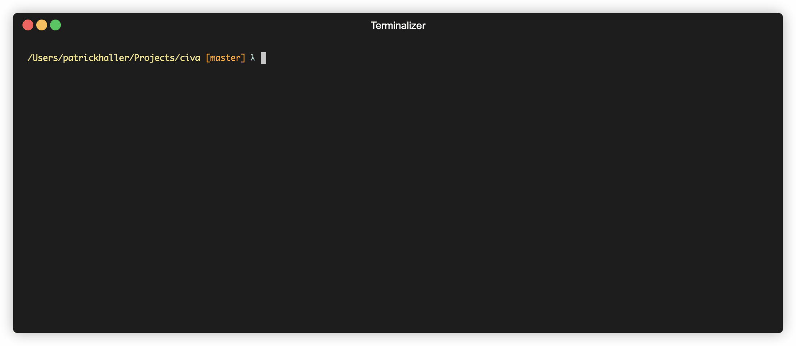

# Civa

  

A own implementation of a shell

## Goals

* Learn UNIX more
* Learn rust more, try not to rely on shell impls in rust, but learn it the hard way
    * Don't use clone (only if reasoned well)
    * Use generics if useful
    * Use lifetimes if useful
* As long as I don't know how dirty code and programs look, I can not build clean code and programs
* Build something I would use, with the approach the build a minimal working program
  and improve it while reaching its limits

## Feature

### Arithmetic Evaluation

On the fly arithmetic evaluation which shows the result while typing

## Todo

- [x] Make Signal Handling proper (use rustyline or signal_hook?)
- [x] Clip Board
- [x] Improve UI
- [x] Handle command splitting
- [x] Implement PATH search and correct command handling (depending on slash)
- [ ] Autocompletion menu and man page/command line autocompletion
- [ ] Handle piping
- [ ] Make Alias System
- [ ] Integration of CMS
  - [ ] Git
  - [ ] SVN
- [ ] Build a config system (python?)
  - [x] Command Bar (UI)
  - [ ] Aliases
- [ ] Use opiniated builtin alternatives to the GNU/Unix tools
- [ ] Tests! (look for good mock library)
- [ ] Thinking of ways to improve shell workflows (own opinion)
- [ ] Read more
- [ ] Setup a more solid test environment, like the [exa](https://github.com/ogham/exa) project with vagrant

## Custom Builtins

* ls -> [exa](https://github.com/ogham/exa)
* cat -> [bat](https://github.com/sharkdp/bat)
* j -> [autojump](https://github.com/wting/autojump)

## Sources

* https://pubs.opengroup.org/onlinepubs/9699919799/utilities/contents.html
* https://github.com/tokenrove/build-your-own-shell
* https://indradhanush.github.io/blog/writing-a-unix-shell-part-1/
* https://indradhanush.github.io/blog/writing-a-unix-shell-part-2/
* https://indradhanush.github.io/blog/writing-a-unix-shell-part-3/
